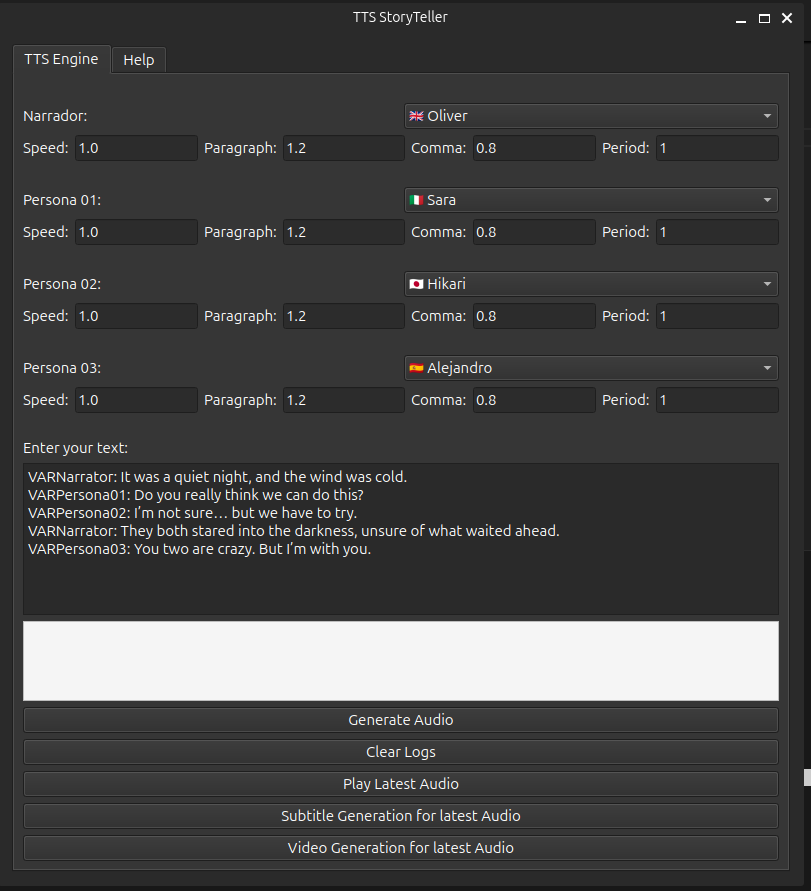

# 📖 User Guide - StoryTellerTTS

## 🔹 Main Features

- ✅ **Multiple Character Narration** - Assign different voices to Narrator and up to 3 characters.
- ✅ **Speech Control** - Fine-tune pauses for paragraphs, commas, and periods.
- ✅ **Character Tagging** - Use tags like `VARNarrator`, `VARPersona01` to assign speech.
- ✅ **Real-time Logs** - Follow the audio generation process step by step.
- ✅ **Subtitle Generation** - Generate synchronized SRT subtitle files from your script.
- ✅ **Video Generation** - Combine audio and subtitles into a video automatically.
- ✅ **Clear Logs** - Reset the log area with one click.

## 🚀 Step-by-Step Usage Guide

1. **Select Voices:** Assign a voice to the Narrator and each character (up to 3).
2. **Adjust Speech Settings:** Define speed and pauses between paragraphs, commas, and periods.
3. **Input Your Script:** Type or paste the story using tags like `VARNarrator`, `VARPersona01`, etc.
4. **Click "Generate Audio":** This will create the speech using the selected settings.
5. **Click "Play Latest Audio":** Listen to the most recently generated audio.
6. **Click "Subtitle Generation for latest Audio":** Create a `.srt` subtitle file matching the speech.
7. **Click "Video Generation for latest Audio":** Render a video combining narration and subtitles.
8. **Click "Clear Logs":** Clear any messages from the log area.

## ⚙️ Default Configuration

The tool uses default TTS models based on the language or accent chosen per character. Voices are automatically matched with their models.

### 🛠 Possible Errors and Solutions

| Error                         | Possible Cause                                         | Solution                                                                 |
|------------------------------|--------------------------------------------------------|--------------------------------------------------------------------------|
| **⚠ Voice Model Not Loaded** | The selected voice model may not be initialized.      | Wait a few moments or try regenerating the audio.                        |
| **🎙 No Audio Output**        | There may be an issue with playback or no audio was generated. | Check if the audio file exists or re-generate it.                        |
| **🧩 Incorrect Tag Format**   | The script is missing a proper voice tag.             | Ensure each line starts with the correct format like `VARNarrator:`.     |
| **📂 Video Not Generated**    | Subtitle file or audio is missing.                    | Make sure you have generated both audio and subtitles before creating the video. |

## 💡 Tips for Better Use

- Keep tags consistent and aligned with voice selections.
- Use punctuation for more natural-sounding speech.
- Separate character speech clearly for smoother transitions.
- Save your script regularly to avoid data loss.

## Example:

VARNarrator: It was a quiet night, and the wind was cold.  
VARPersona01: Do you really think we can do this?  
VARPersona02: I’m not sure… but we have to try.  
VARNarrator: They both stared into the darkness, unsure of what waited ahead.  
VARPersona03: You two are crazy. But I’m with you.  

🚀 You're now ready to bring stories to life with **StoryTellerTTS**!